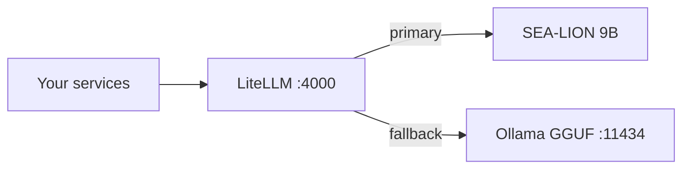

:::note
**⏱ ~25 min · 🟢 Beginner** — By the end: one OpenAI-compatible endpoint on `:4000` that fronts
your local models with retries + fallback.
:::

## Why a proxy

Your clients should talk to **one** endpoint, not juggle model ports. LiteLLM runs on `:4000`
and presents an OpenAI-compatible API; behind it you can route to MLX, Ollama, or a fine-tuned
model, and it adds **retries**, **timeouts**, and **automatic fallback** when a backend is busy
or down. Clients set `OPENAI_BASE_URL=http://localhost:4000/v1` and never hit a model port
directly.



## Step 1 — Pull SEA-LION (Ollama fallback)

**SEA-LION** (by AI Singapore) is a Southeast-Asian language model — a good fit for Taglish.
Pull the 4-bit GGUF build into Ollama; this becomes the reliable fallback backend.

```bash
ollama pull hf.co/aisingapore/Gemma-SEA-LION-v3-9B-IT-GGUF:Q4_K_M
```

:::tip[✓ Verify]
```bash
ollama list
```
shows the SEA-LION GGUF (~5.8 GB).
:::

## Step 2 — Configure LiteLLM

Create `litellm_config.yaml`. Define a primary `sea-lion-9b` model (routed to Ollama for now —
in [chapter 07](/build-your-own-AIChatbot/07-taglish-lora/) you'll repoint it at your fine-tuned MLX model) and a
fallback chain to a GGUF alias.

```yaml
model_list:
  - model_name: sea-lion-9b
    litellm_params:
      model: ollama_chat/hf.co/aisingapore/Gemma-SEA-LION-v3-9B-IT-GGUF:Q4_K_M
      api_base: http://localhost:11434
      timeout: 600
  - model_name: sea-lion-9b-gguf
    litellm_params:
      model: ollama_chat/hf.co/aisingapore/Gemma-SEA-LION-v3-9B-IT-GGUF:Q4_K_M
      api_base: http://localhost:11434
      timeout: 600

litellm_settings:
  num_retries: 2
  request_timeout: 600
  fallbacks: [{ "sea-lion-9b": ["sea-lion-9b-gguf"] }]
```

Start the proxy:

```bash
litellm --config litellm_config.yaml --port 4000
```

:::tip[✓ Verify]
```bash
curl -s localhost:4000/v1/chat/completions -H 'content-type: application/json' \
  -d '{"model":"sea-lion-9b","messages":[{"role":"user","content":"Sabihin: SEA_LION_OK"}]}' \
  | jq -r '.choices[0].message.content'
```
The reply contains `SEA_LION_OK`.
:::

:::caution
None of these services auto-start after a reboot. Each session, bring them up in order:
Ollama → LiteLLM (and later: Postgres, the embeddings server, your Go service). A peer-reset or
timeout almost always means a client hit a raw model port instead of the `:4000` proxy, or a
backend wasn't up yet.
:::

Next: the [data layer →](/build-your-own-AIChatbot/02-data-layer/) — Postgres, pgvector, and embeddings.
