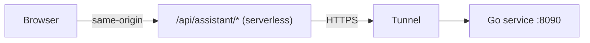

:::note
**⏱ ~30 min · 🟡 Intermediate** — By the end: your local brain reachable from a public web app —
still ~₱0.
:::

Your assistant runs on `:8090` on your Mac. To use it from a real website without exposing your
machine directly or paying for hosting, put a tunnel in front of it and a same-origin serverless
proxy in front of that.



## Step 1 — Expose the local API

Run a tunnel to your local service:

```bash
ngrok http 8090
```

ngrok prints a public HTTPS URL that forwards to `:8090`. For a **stable** URL that survives
restarts, use a Cloudflare Tunnel or an ngrok reserved domain instead.

## Step 2 — Same-origin proxy

So the browser only ever calls your own origin (no CORS, no exposed tunnel URL), add a
serverless function at `/api/assistant/*` that forwards to the tunnel URL held in an environment
variable.

```js
// netlify/functions/assistant.js
export default async (req) => {
  const target = process.env.SOLAR_ASSISTANT_URL;   // the tunnel URL
  const url = target + new URL(req.url).pathname.replace(/^\/api\/assistant/, '/assistant');
  return fetch(url, { method: req.method, headers: req.headers, body: req.body, duplex: 'half' });
};
```

## Step 3 — Wire the widget

A small chat widget on your site posts to `/api/assistant/chat` and renders the streamed tokens.
Because it calls a same-origin path, the browser never sees the tunnel.

```js
const res = await fetch('/api/assistant/chat', {
  method: 'POST',
  headers: { 'content-type': 'application/json' },
  body: JSON.stringify({ message, mode: 'customer' }),
});
// read res.body as a stream and append tokens to the chat UI
```

:::caution
ngrok's free URL **changes every restart**. When it does, update `SOLAR_ASSISTANT_URL` in your
serverless host and **redeploy** — otherwise the proxy points at a dead tunnel. A reserved
ngrok domain or a Cloudflare Tunnel avoids this entirely.
:::

## Step 4 — Rollback & ops

- **Rollback the model:** set `USE_SHORT_PROMPT=false`, repoint LiteLLM's `sea-lion-9b` to the
  Ollama GGUF, and restart LiteLLM. Config-only, no data loss.
- **After a reboot,** nothing auto-starts. Bring services up in order: Colima + Postgres →
  embeddings server `:8100` → LiteLLM `:4000` → (tuned) `mlx_lm.server :8001` → Go service
  `:8090` → tunnel. Then refresh the proxy URL if it changed.

That's the whole system — local, grounded, Taglish, and live. See the [Appendix](/99-appendix/)
for troubleshooting, the cost model, and swapping in a different LLM.
