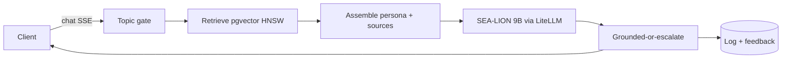

import { Card, CardGrid } from '@astrojs/starlight/components';

You're going to build a **retrieval-augmented chatbot** that answers only from your own
documents, speaks **Taglish**, runs entirely on an Apple-Silicon Mac, and costs roughly
**₱0 per query** because nothing leaves your machine. The worked example is the *Apolaki Solar
Brain* — a support assistant for a solar company — but every step is reusable for any domain:
swap the docs, keep the spine.

<CardGrid>
  <Card title="Grounded" icon="approve-check">
    Answers come only from documents you ingest. No sources found? It says so instead of
    inventing — retrieval-grounded by construction.
  </Card>
  <Card title="Local & private" icon="laptop">
    SEA-LION 9B runs locally via MLX/Ollama behind a LiteLLM proxy. No cloud bill, no data
    leaving your Mac — just electricity.
  </Card>
  <Card title="Taglish voice" icon="comment">
    A fine-tuned LoRA gives the model a consistent Filipino-English advocate persona from a
    short prompt, freeing up context.
  </Card>
  <Card title="Guard-railed" icon="shield">
    Three layers keep it on-topic, grounded, and safe — off-topic questions are redirected and
    electrical-hazard questions escalate to a human.
  </Card>
</CardGrid>

## Architecture

Every request flows through the same pipeline: gate it, retrieve grounding, assemble a persona
prompt with numbered sources, generate with a local model, and either return a grounded answer
or escalate — logging the turn for later improvement.



*Legend:* the **topic gate** rejects off-topic questions before any model call; **retrieval**
finds the most relevant chunks by meaning; the **persona prompt** wraps them with citation
rules; **SEA-LION 9B** generates; **grounded-or-escalate** is the safety net; every turn is
**logged** to feed the retraining flywheel.

If the diagram above doesn't render in your environment, here's the same pipeline as text:

```
Client → Topic gate → Retrieve (pgvector/HNSW) → Assemble (persona + sources)
       → SEA-LION 9B (LiteLLM) → Grounded-or-escalate → {reply to client, log + feedback}
```

## The journey

Build it one layer at a time. Each chapter ends with a **✓ Verify** checkpoint so you know the
layer actually works before moving on.

1. [**00 · Prerequisites**](/build-your-own-AIChatbot/00-prerequisites/) — get your Mac ready.
2. [**01 · Serving stack**](/build-your-own-AIChatbot/01-serving-stack/) — one OpenAI-compatible endpoint with fallback.
3. [**02 · Data layer**](/build-your-own-AIChatbot/02-data-layer/) — Postgres + pgvector + a BGE-M3 embeddings server.
4. [**03 · Ingestion & RAG**](/build-your-own-AIChatbot/03-ingestion-rag/) — chunk, embed, and search your docs by meaning.
5. [**04 · The solar brain**](/build-your-own-AIChatbot/04-solar-brain/) — your first grounded Taglish answer.
6. [**05 · Guardrails**](/build-your-own-AIChatbot/05-guardrails/) — on-topic, grounded, and safe.
7. [**06 · Chat service**](/build-your-own-AIChatbot/06-chat-service/) — a streaming HTTP API with feedback + modes.
8. [**07 · Taglish voice LoRA**](/build-your-own-AIChatbot/07-taglish-lora/) — fine-tune the persona into the model.
9. [**08 · Quantize & A/B**](/build-your-own-AIChatbot/08-quantization/) — shrink the model for cheap serving, A/B-tested against the gate.
10. [**09 · Go live**](/build-your-own-AIChatbot/09-go-live/) — reach your local brain from a public web app.

Then the [Appendix](/build-your-own-AIChatbot/99-appendix/) covers troubleshooting, the ₱0 cost model, and swapping
models. Ready? [Start with the prerequisites →](/build-your-own-AIChatbot/00-prerequisites/)
